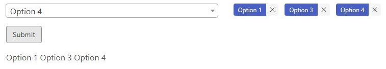

Dynamic Select Widget
================

## Description

Created a code snippet where a standard select widget will display the
options selected as tags. These tags are located outside of the select
widget, instead of within (which is seen with JS libraries such as
selectize and select2) and can be deleted.

Clicking the submit button will return a vector containing the text
values of the tags. These represent all the options that were selected
from the select widget.
